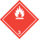
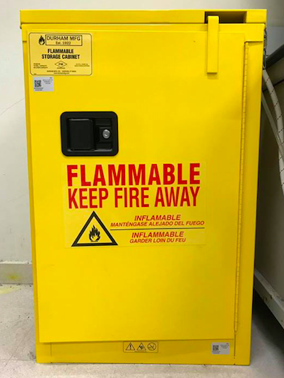

# Chemical Safety

## **Introduction**

Chemical safety covers best practices for handling chemicals that may be hazardous to users and the environment. We recommend that users familiarize themselves with the chemicals used and the associated hazards and regulations.

## **Chemical Hazard Recognition and Labels**

Hazard symbols can differ by country and therefore can be confusing. However, it is important to familiarize yourself with these Hazard Communications (HAZCOM) pictograms or symbols for the safety of personnel, the environment (including aquatic life, plants, and animals), and legal compliance. Disregard for signage may have severe civil and criminal penalties.

In general, we note several Hazard Communications (HAZCOM) symbols from different agencies: United Nations Global Harmonized Systems (GHS), National Fire Protection Agency **(**NFPA), U.S. Department of Transportation (DOT), and International Air Transport Association (IATA). Most agencies, like IATA, are moving toward the GHS system.

Information about what signage means is widely distributed and freely available on the web. It is best practice to read and understand local regulations and talk to professionals (e.g., environmental health and safety officers, local schools, or universities) about how best to interpret signage and what signage you should be used in the lab.

## **Chemical Safety Symbols: Global Harmonized System**

Global Harmonized System ([GHS) pictograms](https://www.acs.org/content/acs/en/chemical-safety/basics/ghs.html) help to identify the danger of the chemical or substance. [Hazard Communications (HAZCOM)](https://www.unece.org/trans/danger/publi/ghs/pictograms.html) pictograms are the most common symbols you will see on chemical containers, manifests, paperwork (such as Safety Data Sheets), and websites about the chemical. They are distinctive diamond shapes that can be in multiple colors and include a number that is associated with the severity of the danger with 1 being the most hazardous and 4 being the least hazardous.

(Note that this is the opposite of the U.S. National Fire Protection Association [NFPA] numbers, which state that 4 is the most hazardous and 1 is the least hazardous.)

There has been a recent movement to simplify communications and safety symbols around chemical safety. The goal is to help everyone, and especially emergency responders, understand hazards that are encountered and how to best be prepared for those hazards.

The United Nations (UN) has proposed moving to GHS for communicating chemical safety. This was done to ease global trade and establish an international standard for chemical safety. At this time, the GHS system is implemented differently around the world, so it&#39;s important to understand these regulatory differences.

The following pages show the graphics depicting the different types of symbols and what they represent. More information can be found by following the links.

## [**GHS Implementation in Different Countries**](https://pubchem.ncbi.nlm.nih.gov/ghs/#_eu)

- [GHS in EU/CLP](https://www.chemsafetypro.com/Topics/EU/CLP_Regulation_EC_No_1272_2008.html)
- [GHS in USA](https://www.chemsafetypro.com/Topics/USA/GHS_in_USA_SDS_label.html)
- [GHS in Switzerland](https://www.chemsafetypro.com/Topics/CH/Switzerland_GHS.html)
- [GHS in Turkey](https://www.chemsafetypro.com/Topics/Turkey/GHS_in_Turkey_SDS_label.html)
- [GHS in Australia](https://www.chemsafetypro.com/Topics/Australia/Australia_GHS.html)
- [GHS in Canada](https://www.chemsafetypro.com/Topics/Canada/Canada_GHS.html)
- [GHS in Brazil](https://www.chemsafetypro.com/Topics/GHS/GHS_in_Brazil.html)
- [GHS in China](https://www.chemsafetypro.com/Topics/China/GHS_in_China_SDS_label.html)
- [GHS in Korea](https://www.chemsafetypro.com/Topics/Korea/GHS_in_Korea_SDS_label.html)
- [GHS in Japan](https://www.chemsafetypro.com/Topics/Japan/GHS_in_Japan_SDS_label.html)
- [GHS in Taiwan](https://www.chemsafetypro.com/Topics/Taiwan/GHS_in_Taiwan_SDS_label.html)
- [GHS in Singapore](https://www.chemsafetypro.com/Topics/GHS/GHS_in_Singapore.html)
- [GHS in Indonesia](https://www.chemsafetypro.com/Topics/GHS/GHS_in_Indonesia.html)
- [GHS in Malaysia](https://www.chemsafetypro.com/Topics/Malaysia/GHS_in_Malaysia_SDS_label.html)
- [GHS in Thailand](https://www.chemsafetypro.com/Topics/Thailand/GHS_in_Thailand_SDS_label.html)
- [GHS in Vietnam](https://www.chemsafetypro.com/Topics/Vietnam/GHS_in_Vietnam_SDS_label.html)
- [GHS in Philippines](https://www.chemsafetypro.com/Topics/Philippine/GHS_in_Philippines_SDS_label.html)
- [GHS in New Zealand](https://www.chemsafetypro.com/Topics/NZ/GHS_in_New_Zealand_SDS_label.html)
- [GHS in Other Countries](https://www.chemsafetypro.com/Topics/GHS/GHS_in_Other_Countries.html)

**Table 1. GHS Hazard Classifications**

|  |  |  |  |  |  |  |
| --- | --- | --- | --- | --- | --- | --- |
| Explosive[gif](https://www.unece.org/fileadmin/DAM/trans/danger/publi/ghs/pictograms/explos.gif)[eps](https://www.unece.org/fileadmin/DAM/trans/danger/publi/ghs/pictograms/explos.eps)[label](https://www.unece.org/fileadmin/DAM/trans/danger/publi/ghs/pictograms/explos.tif) | Flammable[gif](https://www.unece.org/fileadmin/DAM/trans/danger/publi/ghs/pictograms/flamme.gif)[eps](https://www.unece.org/fileadmin/DAM/trans/danger/publi/ghs/pictograms/flamme.eps)[label](https://www.unece.org/fileadmin/DAM/trans/danger/publi/ghs/pictograms/flamme.tif) | Oxidizer[gif](https://www.unece.org/fileadmin/DAM/trans/danger/publi/ghs/pictograms/rondflam.gif)[eps](https://www.unece.org/fileadmin/DAM/trans/danger/publi/ghs/pictograms/rondflam.eps)[label](https://www.unece.org/fileadmin/DAM/trans/danger/publi/ghs/pictograms/rondflam.tif) | Compressed gas[gif](https://www.unece.org/fileadmin/DAM/trans/danger/publi/ghs/pictograms/bottle.gif)[eps](https://www.unece.org/fileadmin/DAM/trans/danger/publi/ghs/pictograms/bottle.eps)[label](https://www.unece.org/fileadmin/DAM/trans/danger/publi/ghs/pictograms/bottle.tif) | Corrosive[gif](https://www.unece.org/fileadmin/DAM/trans/danger/publi/ghs/pictograms/acid_red.gif)[eps](https://www.unece.org/fileadmin/DAM/trans/danger/publi/ghs/pictograms/acid_red.eps)[label](https://www.unece.org/fileadmin/DAM/trans/danger/publi/ghs/pictograms/acid_red.tif) | Toxic[gif](https://www.unece.org/fileadmin/DAM/trans/danger/publi/ghs/pictograms/skull.gif)[eps](https://www.unece.org/fileadmin/DAM/trans/danger/publi/ghs/pictograms/skull.eps)[label](https://www.unece.org/fileadmin/DAM/trans/danger/publi/ghs/pictograms/skull.tif) | Irritant[gif](https://www.unece.org/fileadmin/DAM/trans/danger/publi/ghs/pictograms/exclam.gif)[eps](https://www.unece.org/fileadmin/DAM/trans/danger/publi/ghs/pictograms/exclam.eps)[label](https://www.unece.org/fileadmin/DAM/trans/danger/publi/ghs/pictograms/exclam.tif) |
|  |  |  |  |  |  |  |
| Health hazard[gif](https://www.unece.org/fileadmin/DAM/trans/danger/publi/ghs/pictograms/silhouete.gif)[eps](https://www.unece.org/fileadmin/DAM/trans/danger/publi/ghs/pictograms/silhouete.eps)[label](https://www.unece.org/fileadmin/DAM/trans/danger/publi/ghs/pictograms/silhouete.tif) | Environmental hazard[gif](https://www.unece.org/fileadmin/DAM/trans/danger/publi/ghs/pictograms/Aquatic-pollut-red.gif)[eps](https://www.unece.org/fileadmin/DAM/trans/danger/publi/ghs/pictograms/Aquatic-pollut-red.eps)[label](https://www.unece.org/fileadmin/DAM/trans/danger/publi/ghs/pictograms/Aquatic-pollut-red.tif) | Explosives Division 1.1[gif](https://www.unece.org/fileadmin/DAM/trans/danger/publi/ghs/TDGpictograms/1-1.gif)[eps](https://www.unece.org/fileadmin/DAM/trans/danger/publi/ghs/TDGpictograms/1-1.eps)[label](https://www.unece.org/fileadmin/DAM/trans/danger/publi/ghs/TDGpictograms/1-1.tif) \* | Explosives Division 1.2[gif](https://www.unece.org/fileadmin/DAM/trans/danger/publi/ghs/TDGpictograms/1-2.gif)[eps](https://www.unece.org/fileadmin/DAM/trans/danger/publi/ghs/TDGpictograms/1-2.eps)[label](https://www.unece.org/fileadmin/DAM/trans/danger/publi/ghs/TDGpictograms/1-2.tif) \* | Explosives Division 1.3[gif](https://www.unece.org/fileadmin/DAM/trans/danger/publi/ghs/TDGpictograms/1-3.gif)[eps](https://www.unece.org/fileadmin/DAM/trans/danger/publi/ghs/TDGpictograms/1-3.eps)[label](https://www.unece.org/fileadmin/DAM/trans/danger/publi/ghs/TDGpictograms/1-3.tif) \* | Explosives Division 1.4[gif](https://www.unece.org/fileadmin/DAM/trans/danger/publi/ghs/TDGpictograms/1-4.gif)[eps](https://www.unece.org/fileadmin/DAM/trans/danger/publi/ghs/TDGpictograms/1-4.eps)[label](https://www.unece.org/fileadmin/DAM/trans/danger/publi/ghs/TDGpictograms/1-4.tif) \* | Explosives Division 1.5[gif](https://www.unece.org/fileadmin/DAM/trans/danger/publi/ghs/TDGpictograms/1-5.gif)[eps](https://www.unece.org/fileadmin/DAM/trans/danger/publi/ghs/TDGpictograms/1-5.eps)[label](https://www.unece.org/fileadmin/DAM/trans/danger/publi/ghs/TDGpictograms/1-5.tif) \* |
|  |  |  |  |  |  |  |
| Explosives Division 1.6[gif](https://www.unece.org/fileadmin/DAM/trans/danger/publi/ghs/TDGpictograms/1-6.gif)[eps](https://www.unece.org/fileadmin/DAM/trans/danger/publi/ghs/TDGpictograms/1-6.eps)[label](https://www.unece.org/fileadmin/DAM/trans/danger/publi/ghs/TDGpictograms/1-6.tif) \* | Flammable gases[gif](https://www.unece.org/fileadmin/DAM/trans/danger/publi/ghs/TDGpictograms/rouge2.gif)[eps](https://www.unece.org/fileadmin/DAM/trans/danger/publi/ghs/TDGpictograms/rouge2.eps)[label](https://www.unece.org/fileadmin/DAM/trans/danger/publi/ghs/TDGpictograms/rouge2.tif) \*\* | Flammable gases[gif](https://www.unece.org/fileadmin/DAM/trans/danger/publi/ghs/TDGpictograms/rouge2_noir.gif)[eps](https://www.unece.org/fileadmin/DAM/trans/danger/publi/ghs/TDGpictograms/rouge2_noir.eps)[label](https://www.unece.org/fileadmin/DAM/trans/danger/publi/ghs/TDGpictograms/rouge2_noir.tif) \*\*\* | Non-flammable non-toxic gases[gif](https://www.unece.org/fileadmin/DAM/trans/danger/publi/ghs/TDGpictograms/vert.gif)[eps](https://www.unece.org/fileadmin/DAM/trans/danger/publi/ghs/TDGpictograms/vert.eps)[label](https://www.unece.org/fileadmin/DAM/trans/danger/publi/ghs/TDGpictograms/vert.tif) | Non-flammable non-toxic gases[gif](https://www.unece.org/fileadmin/DAM/trans/danger/publi/ghs/TDGpictograms/vert_blanc.gif)[eps](https://www.unece.org/fileadmin/DAM/trans/danger/publi/ghs/TDGpictograms/vert_blanc.eps)[label](https://www.unece.org/fileadmin/DAM/trans/danger/publi/ghs/TDGpictograms/vert_blanc.tif) | Flammable liquids[gif](https://www.unece.org/fileadmin/DAM/trans/danger/publi/ghs/TDGpictograms/rouge3.gif)[eps](https://www.unece.org/fileadmin/DAM/trans/danger/publi/ghs/TDGpictograms/rouge3.eps)[label](https://www.unece.org/fileadmin/DAM/trans/danger/publi/ghs/TDGpictograms/rouge3.tif) \*\* | Flammable liquids[gif](https://www.unece.org/fileadmin/DAM/trans/danger/publi/ghs/TDGpictograms/rouge3_noir.gif)[eps](https://www.unece.org/fileadmin/DAM/trans/danger/publi/ghs/TDGpictograms/rouge3_noir.eps)[label](https://www.unece.org/fileadmin/DAM/trans/danger/publi/ghs/TDGpictograms/rouge3_noir.tif) \*\*\* |
|  |  |  |  |  |  |  |
| Substances liable to spontaneous combustion[gif](https://www.unece.org/fileadmin/DAM/trans/danger/publi/ghs/TDGpictograms/blan-red.gif)[eps](https://www.unece.org/fileadmin/DAM/trans/danger/publi/ghs/TDGpictograms/blan-red.eps)[label](https://www.unece.org/fileadmin/DAM/trans/danger/publi/ghs/TDGpictograms/blan-red.tif) | Flammable solids, self-reactive substance,s and solid desensitized explosives[gif](https://www.unece.org/fileadmin/DAM/trans/danger/publi/ghs/TDGpictograms/stripes.gif)[eps](https://www.unece.org/fileadmin/DAM/trans/danger/publi/ghs/TDGpictograms/stripes.eps)[label](https://www.unece.org/fileadmin/DAM/trans/danger/publi/ghs/TDGpictograms/stripes.tif) | Substances which in contact with water emit flammable gases[gif](https://www.unece.org/fileadmin/DAM/trans/danger/publi/ghs/TDGpictograms/bleu4.gif)[eps](https://www.unece.org/fileadmin/DAM/trans/danger/publi/ghs/TDGpictograms/bleu4.eps)[label](https://www.unece.org/fileadmin/DAM/trans/danger/publi/ghs/TDGpictograms/bleu4.tif) \*\* | Substances which in contact with water emit flammable gases[gif](https://www.unece.org/fileadmin/DAM/trans/danger/publi/ghs/TDGpictograms/bleu4_noir.gif)[eps](https://www.unece.org/fileadmin/DAM/trans/danger/publi/ghs/TDGpictograms/bleu4_noir.eps)[label](https://www.unece.org/fileadmin/DAM/trans/danger/publi/ghs/TDGpictograms/bleu4_noir.tif) \*\*\* | Oxidizing substances[gif](https://www.unece.org/fileadmin/DAM/trans/danger/publi/ghs/TDGpictograms/jaune5-1.gif)[eps](https://www.unece.org/fileadmin/DAM/trans/danger/publi/ghs/TDGpictograms/jaune5-1.eps)[label](https://www.unece.org/fileadmin/DAM/trans/danger/publi/ghs/TDGpictograms/jaune5-1.tif) | Organic peroxides[gif](https://www.unece.org/fileadmin/DAM/trans/danger/publi/ghs/TDGpictograms/5-2red.gif)[eps](https://www.unece.org/fileadmin/DAM/trans/danger/publi/ghs/TDGpictograms/5-2red.eps)[label](https://www.unece.org/fileadmin/DAM/trans/danger/publi/ghs/TDGpictograms/5-2red.tif) | Organic peroxides[gif](https://www.unece.org/fileadmin/DAM/trans/danger/publi/ghs/TDGpictograms/5-2red_noir.gif)[eps](https://www.unece.org/fileadmin/DAM/trans/danger/publi/ghs/TDGpictograms/5-2red_noir.eps)[label](https://www.unece.org/fileadmin/DAM/trans/danger/publi/ghs/TDGpictograms/5-2red_noir.tif) |
|  |  |  |
 |
 |
 |
 |
| Toxic substances[gif](https://www.unece.org/fileadmin/DAM/trans/danger/publi/ghs/TDGpictograms/skull_2.gif)[eps](https://www.unece.org/fileadmin/DAM/trans/danger/publi/ghs/TDGpictograms/skull_2.eps)[label](https://www.unece.org/fileadmin/DAM/trans/danger/publi/ghs/TDGpictograms/skull_2.tif) | Toxic substances[gif](https://www.unece.org/fileadmin/DAM/trans/danger/publi/ghs/TDGpictograms/skull6.gif)[eps](https://www.unece.org/fileadmin/DAM/trans/danger/publi/ghs/TDGpictograms/skull6.eps)[label](https://www.unece.org/fileadmin/DAM/trans/danger/publi/ghs/TDGpictograms/skull6.tif) | Corrosive substances[gif](https://www.unece.org/fileadmin/DAM/trans/danger/publi/ghs/TDGpictograms/acide.gif)[eps](https://www.unece.org/fileadmin/DAM/trans/danger/publi/ghs/TDGpictograms/acide.eps)[label](https://www.unece.org/fileadmin/DAM/trans/danger/publi/ghs/TDGpictograms/acide.tif) |
 |
 |
 |
 |

## **National Fire Protection Association Placards and the NFPA Diamond**

The National Fire Protection Agency ([NFPA](https://www.nfpa.org/Assets/files/AboutTheCodes/704/NFPA704_HC2012_QCard.pdf)) evaluates and educates on best fire safety practices globally. [NFPA](https://www.nfpa.org/Assets/files/AboutTheCodes/704/NFPA704_HC2012_QCard.pdf) policies in a particular country may be found by doing a local code search on the NFPA website ([https://codefinder.nfpa.org/](https://codefinder.nfpa.org/)).

The [NFPA 704 diamond](https://www.nfpa.org/assets/files/aboutthecodes/704/704_faqs.pdf) (pictured below) is typically found on buildings, but might be seen on doors and large tanks. It is used to quickly identify the severity of hazards in a location and inform users about any special hazards. They are often seen accompanying a United Nations Global Harmonized System (GHS) and Department of Transportation (DOT) placard with a hazard class of the chemical. Some countries, such as [Australia](https://www.safeworkaustralia.gov.au/system/files/documents/1702/ghs-information-sheet-23052016.pdf), have started to adopt some of the trainings from the U.S. but may also have local labeling systems.

NFPA Safety Diamond

NFPA explanation guide

## **U.S. Department of Transportation (DOT) Placards**

[U.S. Department of Transportation (DOT) and International Air Transport Association (IATA) regulations](https://docs.google.com/document/d/1GSj94EPm5sRLWfVANHygogkd-lxe4FesQSHX9I50tWI/edit) cover the transportation (s[ee Chapter 11 - Acquiring, Shipping, and Transporting Materials](https://docs.google.com/document/d/1GSj94EPm5sRLWfVANHygogkd-lxe4FesQSHX9I50tWI/edit)) of hazardous goods and can include symbols beyond the HAZCOM set. These may include special shipments and most often use the HAZCOM symbols but can include other symbols depending on the country or transportation system. Many of the transportation placards in the case of transportation have a number associated with them (see below).

The UN 1203 placard is one of the most common placards seen on the highway and indicates that the vehicle is transporting a flammable liquid, such as gasoline.

U.S. Department of Transportation (DOT) Placards

## Safety Data Sheets (SDS)

Safety Data Sheets or SDS are documents that contain information about the hazards associated with each chemical and guidance for its safe handling and disposal. Manufacturers and suppliers of reagents are required to make a SDS available when a product is purchased. Many of the larger suppliers (e.g., Sigma Aldrich, VWR) provide SDS files that can be downloaded from their website for all of the hazardous products they sell.

Many local regulatory agencies (such as OSHA, the EPA, and most fire departments) recommend or require having a physical copy of the SDS for all chemicals in the lab. We recommend having these sheets alphabetized in a file and readily accessible in the event of a spill or injury. Having SDS accessible to emergency service providers and personnel in the lab is especially useful to quickly look up information about the chemicals in the lab.

Note thatSDS guidance and quality can differ greatly between suppliers and manufacturers. Before starting work with a hazardous chemical, consider reading more than one SDS to ensure nothing has been overlooked.

## Types of Hazardous Chemicals

### **Flammable**

Flammable chemicals are classified by their flash point. They can be solids, liquids, or gases. Particular care should be taken with solvents that should be handled in a chemical fume hood and not used near hot plates which could ignite if spilled, and could easily be drawn up into the exhaust ducts with catastrophic consequences. Solvents and flammable chemicals should never be stored in standard refrigerators and freezers, which contain a source of ignition. If temperature-sensitive solvents are needed, store them in &quot;spark-free&quot; appliances.

Acetone deserves special mention as a common but very flammable solvent with a low flash point (i.e., it can be ignited at a low ambient temperature) and therefore presents a significant fire hazard. A spill of a gallon bottle of acetone could cause a catastrophic fire or explosion so it should not be transported except in sealed chemical buckets.

Spilled solvents can also react explosively with chemical oxidizing agents (e.g., peroxides, nitric acid). Spilled solvents should therefore be contained immediately with chemical spillage absorbent. However, absorbent soaked with some solvents can self-ignite if improperly disposed of so they should be treated as hazardous waste.

Some chemicals can undergo spontaneous combustion as well. A common example is linseed oil, which can self-ignite if left to dry on oily rags (see [Example 1](https://www.youtube.com/watch?v=MDPLFoWNlV8) and [Example 2](https://www.youtube.com/watch?v=Cw5MqfrxM9g)).

**Storage:** Flammables should be stored in a metal safety cabinet away from any oxidizing agents and sources of heat.

Total quantities of flammable liquid kept in a lab should be kept to a minimum and not exceed 50 liters. No more than 500 ml of flammable liquid should be kept on the open bench at any one time (i.e., only use the minimum amount of flammable liquid needed to carry out work). Flammable liquids should be removed to a suitable cabinet when not in use or no longer required.

Flammable substances must be kept away from sources of ignition including open flames, electrical hot plates, and non-flameproof equipment. Care should be taken when heating substances with low auto-ignition temperatures in order to prevent a fire or explosion. They should also be stored away from any oxidising agent.

Flammable, highly flammable liquids, or extremely flammable liquids (i.e., liquids with a flash point of 60ºC or less, including acetic acid, ethanol, and ether), should be stored in sealed containers in fire-resistant enclosures or cabinets.

Flammables must only be stored in refrigerators and freezers expressly designed for the purpose (i.e., those identified as &quot;spark-proofed&quot; or &quot;sparkfree,&quot; which have all ignition sources removed). Storing flammable solvents in normal refrigerators has caused many lab explosions.

**Disposal:** Larger quantities of almost all flammables must be disposed of by a hazardous waste contractor. Smaller quantities of dilute ethanol could be poured down the drain if allowed by local regulations.

**Cautionary tale:** At Michigan State University, a container of flammable liquid stored in a household refrigerator was ignited. The refrigerator door was blown across the room, windows broken, and the contents of the fridge scattered (see photos [here](https://ehs.msu.edu/news/2015-07-10-fridge-explosion.html)).

### **Corrosives**

Corrosives are acids below pH 4 and bases above pH 10. They can destroy tissue on contact, damage metals and plastics, and liberate oxygen from oxidizers or even chemicals not typically known to be oxidizers. They are possibly self-igniting, and mixing strong acids and bases can have violent reactions.

**Storage:** Corrosive acids and bases should be stored separately from each other and in cabinets with protected shelving (not bare metal shelves). They should be stored away from oxidizers, flammable liquids, and flammable solids.

Inorganic acids (e.g., hydrochloric acid, sulfuric acid, phosphoric acid, chromic acid, nitric acid) should not be stored with organic acids (e.g. acetic acid, trichloroacetic acid, formic acid).

Likewise, inorganic bases (e.g., ammonium hydroxide, potassium hydroxide, sodium hydroxide) should not be stored with organic bases (e.g., hydroxylamine, tetramethylethylamine diamine, triethylamine).

**Disposal:** Hazardous waste contractor.

### **Bases**

Bases have a pH above 7. Strong bases include: lime, sodium hydroxide (NaOH), potassium hydroxide (KOH), barium hydroxide (Ba(OH)2), cesium hydroxide (CsOH), strontium hydroxide (Sr(OH)2), lithium hydroxide (LiOH), sodium amide (NaNH2), and sodium hydride (NaH).

**Storage:** See guidance for corrosives above.

**Disposal:** Very dilute bases can be neutralized and disposed of down the drain (use pH strips to check for successful neutralization). For concentrated bases or large volumes, use a hazardous waste contractor.

### **Acids**

Acids have a pH below 7. Strong acids include: vinegar, lemon juice, hydrochloric acid (HCl), sulfuric acid (H2SO4), nitric acid, HNO3. Hydrofluoric acid (HF) presents a significant hazard for personal injury. We do not recommend its use in community labs.

**Storage:** See guidance for corrosives above.

**Disposal:** Very dilute acids can be neutralized and disposed of down the drain (use pH strips to check for successful neutralisation). For concentrated acids or large volumes, use a hazardous waste contractor.

### **Oxidizers**

Oxidizers are chemicals that generate or liberate oxygen when they decompose or decompose other chemicals. If heat or flame is present, oxidizers decomposing under heat can cause the resulting fire to burn hotter and larger, thus decomposing more of the chemical and liberating more oxygen in the process.

**Storage:** Oxidizers should be stored in a chemical safety cabinet away from strong acids and bases, flammables, combustibles, and organic materials. Oxidizers can be stored with non-combustibles or inorganic material.

**Disposal:** Hazardous waste contractor.

### **Explosives**

Explosives are chemicals that by their very nature are unstable and can release energy and gas rapidly. Chemicals may become explosive by heating, adding an oxidizer, or water. In some cases, just the presence of air can cause rapid decomposition. Explosives are not recommended in community labs.

**Storage:** Store explosives in a secure location away from other chemicals and sources of heat, shock, or friction.

**Disposal:** Hazardous waste contractor.

### **Peroxidizables**

Peroxides are highly oxidizing materials and considerable energy can be released in reactions with common materials. Some peroxide compounds are unstable and can explode. Extreme care should be used in mixing solutions containing peroxides. Peroxides are incompatible with all forms of organic solvents and flammable materials.

**Storage:** Peroxidizables should be stored in a chemical safety cabinet away from strong acids and bases, flammables, combustibles and organic materials. Oxidizers can be stored with non-combustibles or inorganic material.

**Disposal:** Hazardous waste contractor.

### **Toxic**

Toxic chemicals interrupt normal function of cellular activity and may cause death. Toxic chemicals vary in lethality. Toxins are typically quantified using the acronym LD50. The LD50 is the dose that is fatal to 50% of test subjects. It is important to understand the exposure routes and limits in order to manage the risk.

**Storage:** Store toxic chemicals in a ventilated, dry, cool area. Highly toxic chemicals should be stored securely in chemically resistant secondary containers.

**Disposal:** Hazardous waste contractor.

### [**Carcinogens**](https://www.osha.gov/SLTC/carcinogens/index.html) 

Carcinogens are chemicals that cause cancer. Examples include some DNA stains (ethidium bromide is a suspected mutagen) or other compounds that bind to DNA. Other well-known carcinogens include asbestos, ionizing radiation, smoke, wood dust, and formaldehyde. More details can be found at the [American Cancer Society](https://www.cancer.org/cancer/cancer-causes/general-info/known-and-probable-human-carcinogens.html).

**Storage:** Carcinogens should be stored in accordance with the SDS and other chemical properties. Store carcinogens in a ventilated, dry, cool area.

**Disposal:** Hazardous waste contractor.

### [**Teratogens**](https://www.chw.org/medical-care/genetics-and-genomics-program/medical-genetics/teratogens) 

Teratogens use the same pictogram as carcinogens and are chemicals that cause harm to unborn fetuses. Classic example is thalidomide exposure where the drug had [unforeseen health effects on fetuses](https://www.nytimes.com/2013/09/23/booming/the-death-and-afterlife-of-thalidomide.html). Examples of teratogens that could be encountered in labs are ethanol, chloroform, phenol, formaldehyde, toluene, [phenytoin (dilantin)](https://www.chw.org/medical-care/genetics-and-genomics-program/medical-genetics/teratogens/phenytoin-dilantin), and [thalidomide](https://www.ncbi.nlm.nih.gov/pmc/articles/PMC4737249/) (find more from this list at [Purdue University](https://www.purdue.edu/ehps/rem/laboratory/HazMat/Chemical%20Materials/terat.html)). Pregnant women, or women considering becoming pregnant, should consult with their doctor prior to working with these chemicals. In some cases, harmful exposure is easy to avoid through standard laboratory practice. In some situations, it may be necessary to seek alternative protocols or put in place additional safety measures.

**Storage:** Store teratogens in accordance with the SDS and other chemical properties. Store teratogens in a ventilated, dry, cool area.

**Disposal:** Usually via hazardous waste contractor although chemicals of many classes can be teratogens so check specific SDS.

### **Chlorinated Solvents**

Chlorinated solvents (e.g., chlorobenzene, trichloroethylene, and methylene chloride) are used in various etching processes. They have no pictogram. They are particularly harmful, and can cause cancer, organ damage, and death. They should not be mixed with normal solvents in waste bottles. There should be separate waste bottles for chlorinated solvents. As with most solvents, they can be readily absorbed through the skin. We recommend not to use chlorinated solvents in community labs.

**Storage:** Store in ventilated cabinets separately from flammable solvents. In some cases, chlorinated and non-chlorinated solvents can react violently when mixed. Chlorinated solvents will also react strongly with alkali metals (lithium, sodium, potassium, etc.). These substances should never be stored together

**Disposal:** Hazardous waste contractor.

## Chemical Whitelists

Chemical whitelists, such as the one at [BUGSS](http://www.smilesaidtheriver.com/bugsswordpress2/list-pre-approved-organisms-chemicals/) can be useful to quickly inform members of chemicals or mixtures that are generally considered safe and may be used in the space under certain conditions, typically without project review. A whitelist should be developed by the safety team with input from the membership. If possible, consult with experts about local regulations and standards. Safety and health experts from local government, waste haulers, and universities are often forthcoming with their knowledge and may assist in creating good safety policies for the lab. Chemicals whitelists still require the user to know about the chemical&#39;s characteristics, disposal, storage, ownership responsibilities, labeling, or incompatibility of that chemical with other chemicals. Even if a chemical is on a whitelist it does not mean that the chemical is safe in all cases.

The whitelist should include warning symbols and language necessary to convey the associated hazards. Whitelists should also include information about storage, chemical incompatibilities, any legal limits on maximum aggregate amount that may be stored in the lab, disposal requirements, and reference local regulations and resources for proper disposal.

Whitelists should be clearly posted both in and around the lab as well as on the lab&#39;s website. The website provides ease of access and it can be consistently referenced and updated. We recommend that all copies refer to that location as the most up to date version. The whitelist should also include a version or tracking number to help keep the information up-to-date.

## When to Use a Fume Hood

Does your lab have a chemical fume hood? Note that a biosafety cabinet is not a fume hood. Most fume hoods are vented to the outside world, but zoning and other local regulations may prohibit you from having a chemical fume hood in your lab. Instead of external venting, some fume hoods use activated carbon filters to remove chemicals. However, such fume hoods can only handle specific classes of chemicals and may pose a safety hazard when used by unsuspecting beginners! If feasible, it can be a great asset to have in your lab. For a demonstration on fume hoods [click here](https://www.youtube.com/watch?v=nlAaEpWQdwA&amp;feature=youtu.be). In general, a fume hood should be used when working with:

- Chemicals with a National Fire Protection Association (NFPA) Health rating of 3 or 4
- Toxic volatile materials (chloroform, formaldehyde)
- Flammable chemicals
- Carcinogens or particularly hazardous substances
- A procedure that may create an aerosol of a toxic substance
- Reactive or explosive materials or chemicals that may spatter
- Toxic gases (NH3, CO, F2, Cl2, H2S, NO2, etc.)
- Odorous materials, both hazardous and non-hazardous

Different types of hoods and what they do/don&#39;t protect against (Source: Biological Safety Cabinets &quot;A Web-based Training Program&quot; Eagleson Institute [www.eagleson.org](http://www.eagleson.org/)).

## Chemical Procurement and Distribution

Plan experiments with safety in mind. Avoid the use of hazardous chemicals altogether (e.g., do not use phenol-chloroform based DNA extractions) or substitute less hazardous chemicals in lab procedures when possible. Examples include substituting methyl tertiary-butyl ether (MTBE) for ethyl ether, safer blue-light absorbing dyes like SYBR for DNA staining instead of ethidium bromide, formaldehyde-free biological preserving solutions, toluene for benzene, and dichloromethane for chloroform and carbon tetrachloride. Many suggestions for additional substitutions and [Green Chemistry](https://www.pnas.org/content/105/36/13197) methods are available online.

## Safer Alternatives for Common Hazardous Chemicals

See also [Safer chemicals &amp; products for use in the lab](https://www.safety.duke.edu/laboratory-safety/work-practices-ppe/safer-alternatives) by Duke University

### Ethidium Bromide (EtBr)

Chemicals like ethidium bromide are used to stain DNA during gel electrophoresis, quantitative PCR, and other techniques. EtBr poses two significant hazards: (1) Since it fluoresces in UV light, it requires the use of a UV transilluminator to visualize the presence of the DNA, so a suitable cabinet and eye protection must be used to prevent eye damage. (The UV will also damage the DNA in the gel, which makes cutting out fragments from a gel more of a challenge.) (2) EtBr binds to DNA by intercalating between the base pairs. Like virtually all DNA stains, this makes it somewhat mutagenic. While the LD50 of these types of compounds is reported to be low (~100 mg/kg), the long-term effects may increase the risk of cancer.

Ideally community labs should only use DNA stains that do not require the use of UV light, are non-mutagenic, and cannot cross the cell membrane. We recommend that community labs do not use ethidium bromide and switch to blue-light excitable, less toxic stains (e.g., blue-light excitable stains like SYBRSafe, SafeView, GelRed), but be aware that these may still require hazardous waste disposal depending on local regulations and typically have no or few validated decontamination methods. Always use the proper personal protective equipment when using stains.

**Storage and disposal of EtBr and other DNA stains:** Check manufacturer&#39;s instructions and local regulations as these can vary. In some cases, very dilute solutions (e.g., running buffer where the stain was added directly to the gel) can be disposed of down the drain, and gels can be disposed of in standard solid waste. In some cases any contaminated solutions and solids must be disposed of via a hazardous waste contractor.

Concentrated solutions of DNA stain should always be disposed of via a hazardous waste contractor. To cut down on the volume of waste and reduce costs, activated carbon can be used to destain solutions of ethidium bromide allowing the solution to be disposed of in the drain, and only the carbon would need to be disposed of via a hazardous waste contractor. Destaining bags are available commercially for this purpose or you can make up and validate your own, as activated carbon is readily available. There are numerous guides online to decontaminating ethidium bromide using DIY and commercially available solutions (e.g., from [Columbia](https://research.columbia.edu/sites/default/files/content/EHS/Policies/EthidiumBromidePolicy.pdf)and [Berkeley](https://www.ehs.berkeley.edu/sites/default/files/lines-of-services/workplace-safety/47ethidiumbromide.pdf)).

### Phenol/Chloroform (Trizol)

Many older protocols for DNA and RNA extraction rely on the use of phenol/chloroform (or Trizol). However both phenol and chloroform pose significant health hazards. Phenol can cause severe burns to the eyes and skin, and acts as a systemic toxin. Chloroform is a carcinogen, and enhances the ability of phenol to be absorbed by the skin. Both phenol and chloroform rapidly permeate nitrile and other glove materials. The use of phenol/chloroform or Trizol requires safety goggles, special chemical-resistant gloves, is incompatible with contact lenses, and should ideally take place in a chemical fume hood within reach of an emergency shower. There have been many examples of lab injuries from phenol/chloroform:

- [Trizol Splashes on Researcher&#39;s Face, Chest, and Neck during RNA Extraction](https://cls.ucla.edu/lessons-learned/lessons-learned-chemicals/193-trizol-splashes-on-researcher-s-face-chest-and-neck-during-rna-extraction)
- [Lessons learned - Phenol Chloroform Exposure](https://d3qi0qp55mx5f5.cloudfront.net/researchsafety/docs/Lessons_Learned_12-29-2017_final.pdf)
- [Chronic Exposure to Trizol (phenol)?](http://www.protocol-online.org/biology-forums/posts/23073.html)
- [Phenol First Aid and PPE](http://sp.ehs.cornell.edu/lab-research-safety/Documents/Phenol_First_Aid_and_PPE.pdf)
- [Fact Sheet: Phenol-Chloroform Extraction](https://ehrs.upenn.edu/health-safety/lab-safety/chemical-hygiene-plan/fact-sheets/fact-sheet-phenol-chloroform-extraction)

For these reasons,we recommend that community labs do NOT use phenol/chloroform or Trizol **.** In fact, there are several newer methods for RNA extraction that are significantly simpler, safer, and more effective.[This paper](https://academic.oup.com/jinsectscience/article/14/1/268/2384293) compares four RNA extraction kits on insect larva, and shows that the two safest methods (RNeasy and Promega&#39;s SV Total RNA isolation system) also gave the best quality RNA. [This paper](https://www.ncbi.nlm.nih.gov/pmc/articles/PMC2576689/) describes a &quot;simple and safe&quot; method for RNA and DNA extraction from microbes using sodium trichloroacetate. [This page](https://www.thermofisher.com/us/en/home/references/ambion-tech-support/rna-isolation/general-articles/ten-ways-to-improve-your-rna-isolation.html) recommends the Purelink RNA kit from Ambion as the &quot;easiest and safest&quot; method, or the MagMAX mirVana Total RNA Isolation Kit from Applied Biosystems.

### Sodium Azide

Sodium azide is a common pest control chemical and chemical preservative and is also found in air bags and common chemical reactions. It is extremely toxic in small amounts and can produce toxic gases when mixed with metals. It is also listed as an [Extremely Hazardous Substance](https://www.law.cornell.edu/cfr/text/40/appendix-A_to_part_355) (U.S.), and is therefore regulated and can carry legal penalties for improper disposal. Some companies will try and dump this on unsuspecting labs. More information can be found at the [CDC](https://emergency.cdc.gov/agent/sodiumazide/basics/facts.asp). Alternatives to sodium azide include [1-2% 2-chloroacetamide](https://www.safety.duke.edu/laboratory-safety/work-practices-ppe/safer-alternatives) and [ProClin and Kathon](https://viceprovost.tufts.edu//ehs/files/Sodium-Azide-SOP-2015.v2.pdf)

### Cycloheximide

Cycloheximide is an anti-fungal commonly recommended in protocols to select bacterial isolates from mixed cultures. It is toxic to humans and wildlife as well. We recommend using Nystatin (50 mg/L) or Natamycin (21.6 mg/L) as an antifungal in selective media or for plant tissue culturing. For example, the kombucha Genomics project at Counter Culture Labs has had good results using Nystatin.

- [Evaluation of Nystatin as an Alternative to Cycloheximide in Selective Culture Media (ICM)](https://www.tandfonline.com/doi/abs/10.1094/ASBCJ-61-0235)
- [Natamycin as a Fungicide in Agar Media](https://aem.asm.org/content/aem/58/3/1064.full.pdf)

## Inventorying Chemicals

Maintaining a list of all the chemicals in your lab and controlling what comes into the lab is essential for the overall safety of the lab. It&#39;s also imperative information for building managers and emergency services, particularly firefighters and first responders. The information may take the form of a spreadsheet or a special inventory application system, some of which have free tiers (e.g., [ChemInventory](https://www.cheminventory.net/) is free for up to 200 containers).

The inventory should be accessible to all members. If your inventory is kept digitally, consider printing a hard copy to have on hand for easy reference. Make sure the inventory is updated regularly, and check local laws regarding chemical record keeping and reporting.

### Labeling Chemicals in the Lab

Labeling all chemicals, mixtures, and reagents is a necessity. Many of the reagents encountered in the lab are clear liquids, which presents a challenge in trying to differentiate them from each other or water. Some countries, such as the U.S., require that chemicals be labeled or demarcated in a manner where all personnel understand the hazards of the material. Use of particular symbols, pictograms, warning words, may be a requirement of local laws and regulations.

When labeling a chemical container, include the following information:

- Chemical name (e.g., sodium chloride or its chemical formula, NaCl)
- Concentration
- Date received or date opened (depending on the hazardous properties of the chemical)
- Name or initials of owner
- Owners contact information (e.g., phone number or email)
- Hazard symbols or words like flammable, corrosive, and toxic

Print or write this information on a readable surface with a sharpie or permanent marker. This can be done on tape or directly on the container itself. Always consider whether the label and writing is resistant to the chemical in the container and to smudging. A label printer may save time and hassle. Some inventorying systems are even able to print GHS-compliant labels for chemicals on demand (e.g., [ChemInventory](https://www.cheminventory.net/)).

## Chemical Storage and Compatibility

We recommend following the guidelines below when storing chemicals:

- Only keep the minimum stock of substances necessary for the work at hand in the lab.
- Storage in the lab should be in properly designated areas.
- Chemicals not in use should be returned promptly to their correct storage enclosures or cabinets.
- Light-sensitive substances (e.g., chlorinated solvents) should be stored in amber-colored bottles away from the light.
- Do not store substances, especially liquids on the floor, under benches, or where they can be struck by shoes, doors, trolleys, or carts. In addition, do not store chemicals in direct sunlight, such as by windows.
- Liquids or heavy containers and equipment should not be stored above average chest height if in frequent use. This may be acceptable for occasionally used equipment or long-term storage. Users should follow good manual handling practice in retrieving the item.
- Do not store chemically incompatible substances together.

### Chemical Storage Cabinets

When chemical storage cabinets are recommended, they should be solid metal construction, ventilated, and lockable. For storing some corrosives, the metal shelves should be protected by a non-corroding coating. It is recommended to have chemicals stored in secondary containment in case of primary container failing.

  

Example images of safety cabinets that are lockable and labeled for specific hazards, with appropriate separation of different chemical classes on different shelves. Image credits left to right: [Matylda Sęk](https://commons.wikimedia.org/wiki/File:Dangerous_chemicals_cabinet_in_MPI-CBG.jpg) on Wikimedia Commons under [CC-BY-SA 3.0](https://creativecommons.org/licenses/by-sa/3.0/deed.en); [Bamrsykp](https://en.m.wikipedia.org/wiki/File:The_solvent_flammable_cabinet.png) and [U5680336](https://commons.wikimedia.org/wiki/File:Chemical_cabinet3.JPG) on Wikimedia Commons under [CC-BY-SA 4.0](https://creativecommons.org/licenses/by-sa/4.0/deed.en).

## Hazardous Chemical Waste Disposal

See the sections above and [Chapter 12 - Waste Disposal](https://docs.google.com/document/d/1HeG0vtNfyyLkiiXLOywbcziDBv8g3J2bDdhwnjdlg2s/edit#heading=h.rpyjx7hw619m), for specific information on disposing of chemicals in particular classes and the SDS of individual chemicals.

**Do**

- Adequately contain waste in resistant bottles and containers that are closed at all times but appropriately ventilated if the chemical is volatile.
- Place liquid waste containers in secondary containers (pans or trays) to minimize the risk of leaks.
- Clearly label everything. Consider having standard chemical disposal tags, forms, and a chemical waste store, so that lab members can dispose of chemical waste at the earliest opportunity in accordance with local laws.
- Use a hazardous waste contractor for disposing of chemical waste. Contact local companies to find out about their service. If you are associated with a university, you may be able to take advantage of their high volume contracts to save on costs.
- Dispose of empty chemical containers with hazardous waste or recycle them.
- Identify appropriate disposal processes before chemicals enter the lab.
- Include chemical waste disposal in the risk assessment.
- Seek professional advice if unsure of how to dispose of a particular chemical.
- Consider organising an annual chemical inventory and clean-up day to ensure that old or unwanted chemicals do not accumulate in the lab from ex-members or old projects.

**Don&#39;t**

- Mix incompatible chemicals.
- Discard chemicals in sinks, biological waste, or general waste.
- Dispose of volatile chemicals by evaporation.
- Put waste containers in hallways or other public locations
- Move chemicals with precipitation on or in the bottle
- Dispose of chemically contaminated sharps and broken glass in standard chemical waste. se a sharps box or glass bucket.

## Radiation Safety

In biotechnology the use of radioactivity is an antiquated practice. The research community has aggressively turned away from the use of radiation for better methods and cheaper tools and techniques that are less dangerous to the users and the environment. We strongly recommend against working with radioactivity.

Some community labs have been offered or received donated equipment that had been exposed to radioactive material. Sometimes the previous owner viewed donation as an easy disposal route because all the costs and risks of appropriate disposal are thus passed to the community lab.

We recommend not accepting donations of equipment that you suspect has been exposed to radiation—watch out for radioactive warning labels and bear in mind that sometimes people peel them off. If you do end up with equipment in your lab about which you have concerns, contact someone with access to and experience in using a calibrated geiger counter to test the equipment. If it is radioactive, contact local specialist disposal contractors to establish how to get rid of it and anticipate that this could be expensive.

## Compressed Gases and Cryogens

The most common compressed gases used at community labs are nitrogen, carbon dioxide, propane, and compressed air. Although commonly used, these can pose a danger if there is a tank rupture. Compressed gas tanks have been known to release their contents rapidly, thus accelerating the tank through walls or spinning in a small enclosed space, as proven by Myth Busters in [this video](https://www.youtube.com/watch?v=ejEJGNLTo84). In addition, the escaping gas could be toxic or an asphyxiant.

### Risk Assessment for Use of Gases

- Calculate the room air volume and gas volume to understand the concentrations that might be produced under the worst case scenario (e.g., a sudden discharge of the stored gas). If this results in toxic levels of carbon dioxide or oxygen depletion to below 19.5%, consider other scenarios in detail. Do not factor in mechanical ventilation to the risk assessment because it may fail or be turned off and that has been implicated in the death of a researcher in the [UK](https://press.hse.gov.uk/2017/12/12/nhs-trust-and-imperial-college-london-fined-after-death-of-worker/).
- If necessary, based on the calculation and risk assessment, install carbon dioxide monitoring equipment and oxygen monitoring equipment that alerts users to dangerous levels.
- Install signage and ensure all personnel are trained to recognize the alarms and know what to do.

### Storage, Use, and Transport of Gas Cylinders

Exercise care when handling compressed gases and cryogens, especially during transport and storage.

**Cylinder Storage**

- Large cylinders must be secured to a wall, bench or fixed support using a chain or strap placed at 2/3 the height of the cylinder. They should remain mounted during storage and use.
- Cylinder stands could be used as an alternative to straps if it is not possible to affix straps to the wall.
- Ensure the cap protecting the cylinder valve is secured at all times and keep the valve closed at all times except when in use.
- Ensure that smaller tanks are not stored in a place where they could be dropped, bumped into (e.g., by passing trolleys that could snap a valve), or exposed to heat.
- Store empty cylinders closed and secured in a separate location from full cylinders. They should be stored for easy removal.
- Always ensure that all users are trained in the proper mounting, use, and transport of compressed gases. See more information from [OSHA](https://www.osha.gov/SLTC/compressedgasequipment/index.html)).

**Cylinder Transport**

Always use a proper gas cylinder hand cart or truck to which the cylinders can be secured during transport with a chain or belt, even for short distances, e.g., between labs.

**Use of Gas Cylinders**

- Never tamper with pressure relief devices and regulators on valves or cylinders.
- Use the correct tools when manipulating the regulator.
- Only use compressed gases in a well-ventilated area and never in a cold room.
- Any toxic, flammable, and corrosive gases should be handled in a chemical fume hood.
- Always label gas lines if more than one type of gas is in use.
- Inspect valves and tubing regularly for wear, tear, and leaks using soapy water.
- Use the appropriate, manufacturer-recommended regulator for the cylinder and never substitute another regulator.
- Don&#39;t use oil or grease to seal the O-ring on the regulator as it is flammable.

### Carbon Dioxide Gas

Carbon dioxide gas is used for mammalian tissue culture and as an anaesthetic for insects like _Drosophila_. The main safety concerns, besides the physical hazards associated with compressed gas tanks (covered above), are carbon dioxide toxicity, and oxygen displacement. At concentrations between 2 and 10%, carbon dioxide causes an increased respiratory rate, nausea, dizziness, headache, mental confusion, and increased blood pressure. If the carbon dioxide concentration rises above 10%, suffocation and death can occur in minutes.

**Risk Assessment**

You should calculate the worst-case scenario if there was a carbon dioxide leak into the lab and assume that the entire cylinder is released (e.g., using this calculator from the [University of Nottingham](https://www.nottingham.ac.uk/safetyCalculators/Calc-CO2.htm)).

**Safety Measures**

If a leak would result in dangerous levels of carbon dioxide, then you should install a carbon dioxide monitor and alarm system that can be seen and/or heard from the outside of the lab so no-one enters the room. Portable carbon dioxide monitors are available but not recommended as the primary monitoring system; they are intended for people working in confined spaces or as a backup alert.

Remember that a monitor only provides a warning that the sensor is detecting a potentially dangerous concentration of a particular gas. The detector is not in itself a safety device and will not fix the problem so you will need to put in place safety measures:

- Ensure that it is adequate and consider forced ventilation/extraction.
- If you have fitted gas detection monitors/alarms, ensure they are tested, calibrated, and periodically replaced as per manufacturer&#39;s instructions.
- Consider fitting safety devices to cylinders, e.g., excess flow valves detect drops in pressure and drastically reduce the flow of gas from the cylinder.
- Use cable ties and clips to ensure that any tubing is secured and cannot be accidentally pulled off causing a leak.
- Have a regime for checking and maintenance of regulators.
- Train users to operate the equipment safely, recognize the signs of carbon dioxide leaks, interpret the monitor and alarm, and know what to do in an emergency.
- Have a documented plan for responding to a carbon dioxide leak and safely ventilating the room.

### Liquid Nitrogen (LN2)

Cryogens, such as liquid nitrogen, are used to preserve biological specimens or to rapidly freeze them for processing. Liquid nitrogen can rapidly deplete oxygen from the air and is the cause of several deaths in labs. One liter of liquid nitrogen produces approximately 680 litres of gas at room temperature which displace oxygen and lead to suffocation.

**Risk Assessment**

Lawrence Berkeley National Laboratory has a simple Oxygen Deficiency Hazard (ODH) calculator that is useful to determine which rooms are suitable for storing a liquid nitrogen dewar of a specific size, including refills and a use case:

- [Oxygen Deficiency Hazard (ODH) calculator spreadsheet](https://www.lbl.gov/ehs/pub3000/CH29/CH29-ODH_70A-2211.xls) (.xls)
- [Appendix B: An Overview of the ODH Calculator Model](https://www2.lbl.gov/ehs/pub3000/CH29/CH29.html#AppB)

**Safety Measures**

If a leak would result in dangerous levels of oxygen, then you should install an oxygen monitor and alarm system that can be seen and/or heard from the outside of the lab so no-one enters the room. You should also consider the following safety measures:

- Only store liquid nitrogen in rooms with good natural ventilation or install forced ventilation.
- If you have fitted oxygen detection monitors/alarms, ensure they are tested, calibrated and periodically replaced as per manufacturer&#39;s instructions.
- If transported inside a vehicle, make sure to leave windows rolled down to avoid suffocation hazard.
- Liquid nitrogen dewars should never be accompanied in an elevator—have one person place the dewar in the elevator, while a second person waits on the destination floor.
- Liquid nitrogen contact with skin may cause serious freezing (frostbite) injury. Wear insulated gloves at all times that are rated for use with liquid nitrogen. Note that this usually does not mean you could put your gloved hand into the liquid nitrogen—use tongs to retrieve items.
- Wear protective clothing including a lab coat, long-sleeves and pants to be sure that no skin is exposed.
- Wear safety glasses and ideally a face shield when transferring or pouring liquid nitrogen to avoid being splashed in the face or eyes.

**References on LN2 Safety**

- [University College Dublin](https://www.ucd.ie/t4cms/UCD%20Liquid%20Nitrogen%20Safety%20Guide.pdf)
- [Auckland LN N2 safety](https://cdn.auckland.ac.nz/assets/science/for/current-students/HR/health-safety-wellness/documents/SMOU%2021%20Safe%20Storage%20of%20Liquid%20Nitrogen%20(2)%20(2).pdf)
- [Safe Use of Cryogenic Materials](https://www.she.stfc.ac.uk/Pages/SC03_Appendix_3.pdf)
- [Liquid Nitrogen University Policy](https://www.admin.ox.ac.uk/safety/policy-statements/s4-03/)
- [Handling and Storage of Liquid Nitrogen](https://www.monash.edu/ohs/information-and-documents/all-information-sheets/handling-and-storage-of-liquid-nitrogen)
- [Handling Liquid Nitrogen](https://www.tedpella.com/cryo-supplies_html/HandlingLiquidNitrogen.htm)
- [Safe Handling of Cryogenic Liquids](https://www2.lbl.gov/ehs/pub3000/CH29/CH29.html)

## **Dry Ice**

Another source of carbon dioxide is dry ice, which is extremely cold, solid CO2 and is a simple asphyxiant. One kilogram of dry ice produces 540 liters of carbon dioxide gas. Therefore, 10 kg in an average cold room could reduce the oxygen level below 15% and also create a potentially lethal concentration of carbon dioxide.

**Safety Measures**

Other safety measures for handling and transporting dry ice include:

- Dry ice should therefore always be stored in a well-ventilated area and never in a sealed container, this include tightly taped polystyrene boxes (tape on three sides only) and ultralow temperature freezers. Otherwise the pressure build-up as it sublimated could lead to an explosion or rupture of the container.
- If transported inside a vehicle, make sure to leave windows rolled down, to avoid any suffocation hazard. You will also need to label the box as a hazardous material (see [Acquiring, Shipping and Transporting Materials](https://docs.google.com/document/d/1GSj94EPm5sRLWfVANHygogkd-lxe4FesQSHX9I50tWI/edit#heading=h.orodespoomca)).
- Wear protective clothing. Use insulated gloves that are made of a thick material; also wear proper clothing (long-sleeves and pants) to be sure that no skin is exposed.
- Do not dump dry ice down the drain! It may damage the sink or plumbing. Allow it to sublimate at room temperature in a very well ventilated space, ideally outside, or in an externally vented fume hood.

## Drugs and Controlled Substances

Community labs are advised not to store or use any drugs or controlled substances in their protocols. In the U.S., the [Drug Enforcement Agency](https://www.dea.gov/about) strictly regulates these materials. Refer to local regulations for more information.